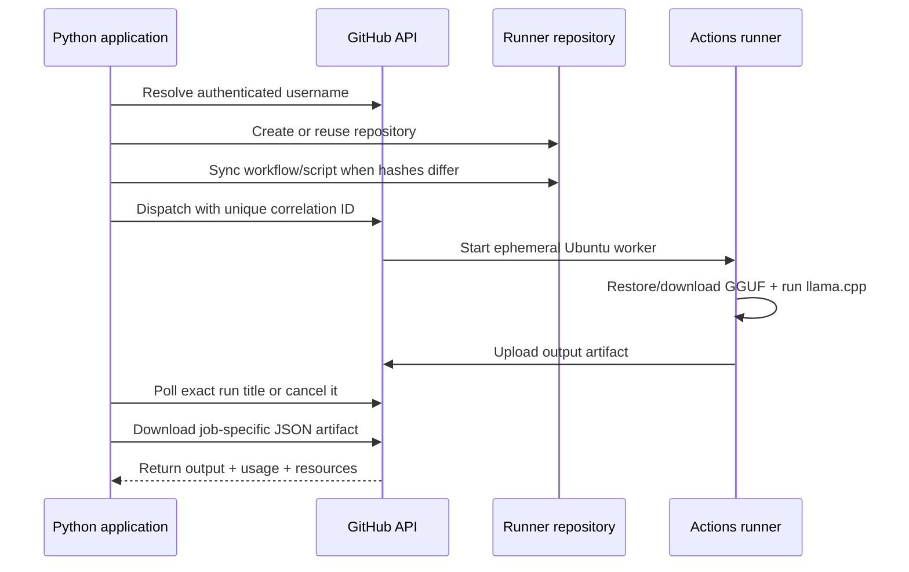

<div align="center">

# ⚡ gh-ai-runner

### Turn any GitHub repo into a serverless AI inference backend — straight from Python.

No server. No GPU. No infrastructure. Just a token, a prompt, and GitHub's own CI runners doing the work.

[](https://pypi.org/project/gh-ai-runner/)
[](https://www.python.org/)
[](#-models)
[](LICENSE)

[Overview](#-overview) · [How it works](#-how-it-works) · [Setup](#-setup) · [Quick start](#-quick-start) · [Core concepts](#-core-concepts) · [Full API reference](#-full-api-reference) · [Recipes](#-recipes--example-snippets) · [Models](#-models) · [Security](#-security-model) · [Troubleshooting](#-troubleshooting--faq)

</div>

---

## 🧠 Overview

`gh-ai-runner` is a Python orchestration package that turns an ordinary GitHub repository into an on-demand AI workload service. Point it at a prompt, and it provisions an ephemeral GitHub Actions runner, executes a quantized LLM with `llama-cpp-python`, and hands the result back to you — no inference server ever stays online between calls.

**Why this exists:** every GitHub account comes with a large pool of free (or cheap) Actions minutes sitting mostly idle. `gh-ai-runner` treats that compute as a disposable, on-demand inference backend: spin a runner up, load a quantized model, run inference, upload the answer as an artifact, tear the runner down. You get LLM inference without renting a GPU, running a server, or managing infrastructure — the tradeoff is latency (cold starts and model downloads take real time) in exchange for effectively free compute.

**Version 0.3** builds on the 0.2 asynchronous runtime by adding:
- Concurrent batch dispatch and multi-model comparisons
- Verified, checksummed results (client- and worker-side SHA-256 digests)
- Privacy-conscious local job metadata (a SQLite history that deliberately excludes prompts, outputs, and secrets)
- A "bring your own provider" mode for OpenAI-compatible hosted APIs, as an alternative to local GGUF inference

The original synchronous `ai_call()` function from 0.1.x is still fully supported, so upgrading doesn't break existing code.

---

## 🔧 How it works

Every call — sync or async — follows the same underlying lifecycle:



Walking through each stage in more depth:

1. **Identity resolution.** The client calls the GitHub API once to resolve which account the token belongs to, so it knows where to create or look for the runner repo.
2. **Repo provisioning.** If the target repo (`ai-inference-runner` by default) doesn't exist, it's created. If it does, it's reused — nothing is torn down between calls.
3. **Hash-based sync.** Rather than committing the workflow file and inference script on every single call, the client computes a SHA-256 of each local file and compares it against what's already committed. A commit only happens when something actually changed, which is what makes the second-and-onward calls noticeably faster than the first.
4. **Dispatch with a correlation ID.** A `workflow_dispatch` event is fired with a randomly generated ID embedded in the run's title (`run-name`). This is the mechanism that makes concurrent jobs safe: polling later looks for an *exact* title match, not "the most recent run," so two jobs racing against each other can't get their results crossed.
5. **Ephemeral execution.** GitHub spins up a fresh Ubuntu-based runner. It restores a cached GGUF model if one exists, or downloads it fresh from Hugging Face, then runs inference through `llama-cpp-python` entirely inside that throwaway VM.
6. **Artifact upload.** The worker writes a structured JSON result (output text, token usage, resource stats, digests) and uploads it as a GitHub Actions artifact scoped to that specific run.
7. **Polling and retrieval.** The client polls the Actions API for the run matching its correlation ID, waits for completion (or lets you cancel it), then downloads and parses the artifact.
8. **Verification.** Before the result is handed back to you, the client checks the output's SHA-256 digest against what the worker reported. A mismatch means the artifact is rejected rather than silently returned.

---

## 📦 Setup

### 1. Install the package

```bash
pip install gh-ai-runner
```

Requires Python 3.9 or newer.

### 2. Create a GitHub personal access token

1. Go to **GitHub → Settings → Developer settings → Personal access tokens**.
2. Generate a token with **`repo`** and **`workflow`** scopes. (`repo` lets the client create/read the runner repository; `workflow` lets it commit workflow files and dispatch runs.)
3. Store it somewhere safe — an environment variable or secret manager, **not** hardcoded in a script you might commit.

```bash
export GH_AI_TOKEN="ghp_xxxxxxxxxxxxxxxxxxxx"
```

### 3. Make sure Actions is enabled

If you're using a brand-new account or a repo created under an organization with restrictive defaults, double check **Settings → Actions → General** allows Actions to run and artifacts to be created.

That's the entire setup. Everything else — repo creation, workflow files, model downloads — is handled automatically on first use.

---

## 🚀 Quick start

```python
import os
from gh_ai_runner import ai_call

answer = ai_call(
    github_token=os.environ["GH_AI_TOKEN"],
    prompt="Explain recursion with one small Python example.",
    model="qwen",
    temperature=0.2,
)

print(answer)
```

On the very first call, `gh-ai-runner` will create the `ai-inference-runner` repo, commit the embedded workflow and inference script, and download/cache the chosen model on the runner. Every call after that reuses the repo and skips re-committing files whose hashes haven't changed.

---

## 🧩 Core concepts

| Concept | What it is |
|---|---|
| **`ai_call()`** | The simplest entry point — synchronous, blocking, returns a plain string. Best for one-off scripts. |
| **`GitHubAIRunner`** | The stateful client. Use this when you need async jobs, batches, comparisons, or a custom provider. |
| **`Job`** | A handle to a single dispatched inference request. Supports `refresh()`, `wait()`, `result()`, `cancel()`. |
| **`BatchJob`** | A handle to a group of jobs dispatched together, sharing a `batch_id`. |
| **`InferenceRequest`** | A single prompt + model (+ optional parameters), used when building a batch. |
| **`InferenceResult`** | The parsed, verified output of a completed job: `.output`, `.usage`, `.resources`. |
| **`RetryPolicy`** | Configuration for how many times, and how, a job should retry on failure. |
| **`JobStatus`** | An enum describing where a job currently is in its lifecycle. |
| **`ProviderConfig`** | Configuration for routing inference to a hosted, OpenAI-compatible API instead of local GGUF. |

---

## 📖 Full API reference

### `ai_call()` — the synchronous one-liner

```python
ai_call(
    github_token: str,
    prompt: str,
    model: str = "tinyllama",
    system: str = "You are a helpful assistant.",
    max_tokens: int = 512,
    temperature: float = 0.7,
    cache: bool = True,
    n_ctx: int | None = None,
    repo_name: str = "ai-inference-runner",
    verbose: bool = True,
) -> str
```

| Parameter | Type | Default | Notes |
|---|---|---|---|
| `github_token` | `str` | — | **Required.** Needs `repo` + `workflow` scopes. |
| `prompt` | `str` | — | **Required.** The user message sent to the model. |
| `model` | `str` | `"tinyllama"` | One of the keys in the [models table](#-models). |
| `system` | `str` | `"You are a helpful assistant."` | System prompt controlling behavior/persona. |
| `max_tokens` | `int` | `512` | Hard-capped at `4096` by validation. |
| `temperature` | `float` | `0.7` | Range `0.0`–`2.0`. `0.0` = deterministic. |
| `cache` | `bool` | `True` | Keeps model weights cached on the runner between runs. |
| `n_ctx` | `int \| None` | `None` (model default) | Context window size, capped at `8192`. |
| `repo_name` | `str` | `"ai-inference-runner"` | Which repo to create/reuse — useful for isolating concurrent workloads. |
| `verbose` | `bool` | `True` | Prints step-by-step progress logs. |

Internally this is a thin wrapper: it builds a `GitHubAIRunner`, calls `.submit()`, blocks on `.result()`, and returns just the `.output` string.

### `GitHubAIRunner` — the stateful client

```python
runner = GitHubAIRunner(github_token: str, repo_name: str = "ai-inference-runner")
```

Key methods:

| Method | Returns | Purpose |
|---|---|---|
| `submit(prompt, **kwargs)` | `Job` | Dispatches a single request without blocking. |
| `submit_batch(requests: list[InferenceRequest])` | `BatchJob` | Dispatches several requests as one tracked group. |
| `compare(prompt, models: list[str], **kwargs)` | `ComparisonJob` | Sends one prompt to multiple models for side-by-side results. |
| `configure_provider(config: ProviderConfig, api_key: str)` | `None` | Encrypts and stores a hosted-provider API key as a repo secret. |
| `list_jobs(limit: int = 20)` | `list[JobRecord]` | Reads recent job history from local metadata. |
| `get_job(job_id, attempt=1)` | `Job` | Reconstructs a handle to a previously submitted job. |
| `resume(job_id)` | `Job` | Alias/helper for picking a job back up after a script restart. |

### `Job` — a single async handle

| Method | Blocking? | Purpose |
|---|---|---|
| `.refresh()` | No | Checks current status without waiting. |
| `.wait(timeout=None)` | Yes | Blocks until the job finishes or the timeout elapses. |
| `.result(timeout=None)` | Yes | Waits if necessary, then downloads + verifies + parses the artifact into an `InferenceResult`. |
| `.cancel()` | No | Requests cancellation through the Actions API. |

### `RetryPolicy`

```python
RetryPolicy(max_retries: int = 0, ...)
```
Controls automatic retry behavior on failed dispatch or timeout. Retries reuse the same `job_id` but get distinct correlation IDs (e.g. `<job-id>-1`, `<job-id>-2`), so history stays traceable across attempts.

### `ProviderConfig`

```python
ProviderConfig.groq(model: str)          # convenience constructor for Groq
ProviderConfig(name, model, base_url)    # generic OpenAI-compatible endpoint (HTTPS only)
```

### `InferenceRequest` / `InferenceResult`

`InferenceRequest(prompt: str, model: str = "tinyllama", **kwargs)` is the unit you pass into `submit_batch()`. `InferenceResult` is what comes back from `.result()`, exposing `.output` (str), `.usage` (token counts), and `.resources` (CPU/memory/disk/duration stats reported by the worker).

---

## 🍳 Recipes / example snippets

### Basic blocking call

```python
from gh_ai_runner import ai_call

result = ai_call(
    github_token="ghp_...",
    prompt="What's the difference between a list and a tuple in Python?",
)
print(result)
```

### Custom persona + longer output

```python
result = ai_call(
    github_token="ghp_...",
    prompt="Explain black holes",
    system="You are a physics professor. Be precise and use analogies.",
    model="llama",
    max_tokens=1024,
)
print(result)
```

### Deterministic output for reproducible tests

```python
result = ai_call(
    github_token="ghp_...",
    prompt="What is 144 divided by 12?",
    temperature=0.0,
    max_tokens=16,
)
assert "12" in result
```

### Silent mode (no progress logs, e.g. inside another CLI tool)

```python
result = ai_call(
    github_token="ghp_...",
    prompt="Summarize the theory of evolution in two sentences.",
    verbose=False,
)
```

### Async submit + manual polling loop

```python
from gh_ai_runner import GitHubAIRunner, RetryPolicy
import time

runner = GitHubAIRunner(github_token="ghp_...")
job = runner.submit(
    "Summarize the tradeoffs of SQLite vs. PostgreSQL.",
    model="qwen",
    retry_policy=RetryPolicy(max_retries=1),
)

while True:
    status = job.refresh()
    print(f"job {job.job_id}: {status}")
    if status.is_terminal:          # adjust to however JobStatus exposes this
        break
    time.sleep(5)

result = job.result(timeout=900)
print(result.output)
print("tokens:", result.usage.total_tokens)
print("peak memory:", result.resources.memory_total_bytes)
```

### Error handling around a job

```python
from gh_ai_runner import GitHubAIRunner

runner = GitHubAIRunner(github_token="ghp_...")

try:
    job = runner.submit("Write three pytest test cases for a stack class.", model="qwen")
    result = job.result(timeout=600)
    print(result.output)
except TimeoutError:
    print(f"Job {job.job_id} didn't finish in time — cancelling.")
    job.cancel()
except Exception as e:
    # Covers dispatch failures, digest-mismatch rejections, and API errors.
    print(f"Job failed: {e}")
```

### Batch dispatch across different models

```python
from gh_ai_runner import GitHubAIRunner, InferenceRequest

runner = GitHubAIRunner("ghp_...")
batch = runner.submit_batch([
    InferenceRequest("Summarize this release note.", model="tinyllama"),
    InferenceRequest("Write three test cases.", model="qwen"),
    InferenceRequest("Explain this stack trace.", model="phi3"),
])

for result in batch.results(timeout=900):
    print(f"[{result.model}] {result.output}\n")
```

### Head-to-head model comparison

```python
comparison = runner.compare(
    "Explain optimistic concurrency control.",
    models=["tinyllama", "qwen", "phi3"],
    max_tokens=300,
)

for model, result in comparison.results_by_model().items():
    print(f"--- {model} ({result.usage.total_tokens} tokens) ---")
    print(result.output)
```

### Parallel calls using isolated repos

Because correlation is per-repo, truly parallel workloads should use **separate repo names** to get independent run queues:

```python
import threading
from gh_ai_runner import ai_call

TOKEN = "ghp_..."
results = {}

def run(key, prompt, repo):
    results[key] = ai_call(
        github_token=TOKEN,
        prompt=prompt,
        repo_name=repo,
        verbose=False,
    )

t1 = threading.Thread(target=run, args=("q1", "Explain DNA replication.", "runner-repo-1"))
t2 = threading.Thread(target=run, args=("q2", "Explain RNA splicing.", "runner-repo-2"))

t1.start(); t2.start()
t1.join();  t2.join()

print(results["q1"])
print(results["q2"])
```

### Bringing your own hosted model (Groq example)

```python
from gh_ai_runner import GitHubAIRunner, ProviderConfig

runner = GitHubAIRunner("ghp_...")
groq = ProviderConfig.groq("llama-3.3-70b-versatile")

runner.configure_provider(groq, api_key="gsk_...")
result = runner.submit("Explain B-trees.", provider=groq).result()
print(result.output, result.usage)
```

### Bringing your own hosted model (generic OpenAI-compatible endpoint)

```python
from gh_ai_runner import GitHubAIRunner, ProviderConfig

runner = GitHubAIRunner("ghp_...")
custom = ProviderConfig(
    name="my-endpoint",
    model="some-model-id",
    base_url="https://my-inference-host.example.com/v1",   # must be HTTPS
)

runner.configure_provider(custom, api_key="sk-...")
result = runner.submit("Draft a haiku about compilers.", provider=custom).result()
print(result.output)
```

> Calling `configure_provider()` again **rotates** the previously stored key — there's one provider-key slot per runner repo.

### Resuming and inspecting job history

```python
runner = GitHubAIRunner("ghp_...")

recent = runner.list_jobs(limit=20)
for record in recent:
    print(record.job_id, record.status, record.model, record.duration)

resumed = runner.resume(recent[0].job_id)
print(resumed.refresh())
```

### Disabling persistent metadata

```python
# Nothing gets written to ~/.gh_ai_runner/jobs.sqlite3
runner = GitHubAIRunner("ghp_...", metadata_path=None)

# Or point it at a custom location, e.g. for a shared/team setup
runner = GitHubAIRunner("ghp_...", metadata_path="/var/data/gh_ai_runner/jobs.sqlite3")
```

---

## 🤖 Models

| Key | Model | GGUF size | Default context | Good fit |
|---|---|---|---|---|
| `tinyllama` | TinyLlama 1.1B Chat | 0.6 GB | 2,048 | Fast, low-latency answers where quality matters less than speed. |
| `llama` | Llama 3.2 1B Instruct | 0.7 GB | 4,096 | General-purpose instruction following. |
| `phi3` | Phi-3.5 Mini Instruct | 2.2 GB | 4,096 | The strongest reasoning of the set — costs more download/cold-start time. |
| `qwen` | Qwen 2.5 1.5B Instruct | 1.0 GB | 4,096 | Code generation and math-heavy prompts. |
| `gemma2` | Gemma 2 2B Instruct | 1.6 GB | 4,096 | Balanced chat/instruction quality. |
| `deepseek` | DeepSeek-R1 1.5B | 1.1 GB | 4,096 | Step-by-step, deliberative reasoning chains. |

**Choosing a model in practice:**
- Prototyping or a smoke test → `tinyllama` (fastest cold start).
- General assistant behavior → `llama` or `gemma2`.
- Anything code- or math-adjacent → `qwen`.
- A task that benefits from visible step-by-step reasoning → `deepseek`.
- When quality matters more than speed and you can tolerate a bigger download → `phi3`.

**Limits enforced by validation, regardless of model:** context window ≤ 8,192 tokens, generated output ≤ 4,096 tokens, temperature within `0.0`–`2.0`. The package also estimates required memory from model size plus requested context *before* dispatching, so a job that would obviously exceed the runner's resources fails fast locally instead of burning a full CI run.

---

## 🔒 Security model

- **Tokens** are supplied by the caller at runtime and should live in a secret store or environment variable — never hardcoded in source you might commit.
- **Provider API keys** (for the bring-your-own-provider mode) are encrypted client-side using the target repo's GitHub public key (a "sealed box"), then stored only as the `GH_AI_PROVIDER_API_KEY` Actions secret. They are never passed through workflow inputs and never written into any result artifact.
- **Result integrity** is enforced two ways: the client computes a SHA-256 digest of the normalized request before dispatch, and the worker computes a digest of the generated output. If job identity, request digest, output digest, or algorithm don't line up on return, the artifact is rejected rather than trusted.
- **Local job metadata** (`~/.gh_ai_runner/jobs.sqlite3` by default) intentionally excludes prompt text, system text, output text, GitHub tokens, and provider keys — only structural metadata (IDs, status, model, timestamps, token counts, digests) is persisted.

---

## 🏗️ Package architecture

```
gh_ai_runner/
├── client.py       asynchronous client and secure provider setup
├── job.py          status, waiting, retry, result, and cancellation handle
├── batch.py        concurrent batch and comparison handles
├── metadata.py     privacy-conscious SQLite job metadata
├── integrity.py    canonical request and output digests
├── types.py        typed results, telemetry, policies, and errors
├── core.py         backwards-compatible ai_call wrapper
├── repo.py         repo creation and hash-based file sync
├── runner.py       embedded workflow and inference script
├── models.py       model catalog and resource limits
├── validation.py   parameter and memory validation
├── polling.py      workflow run discovery/completion
├── artifact.py     output download and extraction
└── logger.py       elapsed-time progress reporting
```

---

## 🩺 Troubleshooting / FAQ

**"My token doesn't work / 403 errors on dispatch."**
Double check the token has both `repo` and `workflow` scopes — `repo` alone isn't enough to commit workflow files or trigger `workflow_dispatch`.

**"The first call is really slow."**
Expected — it's creating the repo, committing the workflow and script, and cold-downloading the model on a fresh runner. Every call afterward skips the redundant commits and can reuse the cached model, so latency drops substantially.

**"Two jobs I ran around the same time seem to have swapped results."**
This shouldn't happen given the correlation-ID + exact-title-match polling design — if you see it, check whether both jobs were dispatched to the *same* `repo_name` with manually reused job IDs. For genuinely parallel workloads, use separate `repo_name`s (see the parallel-calls recipe above).

**"A job times out but I don't know if it's still running on GitHub."**
Call `.refresh()` on the job handle to check status without blocking, and `.cancel()` if you want to stop it via the Actions API rather than just abandoning the local handle.

**"I don't want any local history kept."**
Pass `metadata_path=None` when constructing `GitHubAIRunner` to disable the local SQLite metadata store entirely.

---

## 🎯 Skills demonstrated

Python package design · REST orchestration · CI as compute · idempotent provisioning · content hashing · polling/event correlation · artifact retrieval · resource validation · open-model deployment

---

## 📄 License

MIT © [Tanish Chauhan](https://github.com/TanishC4444)
