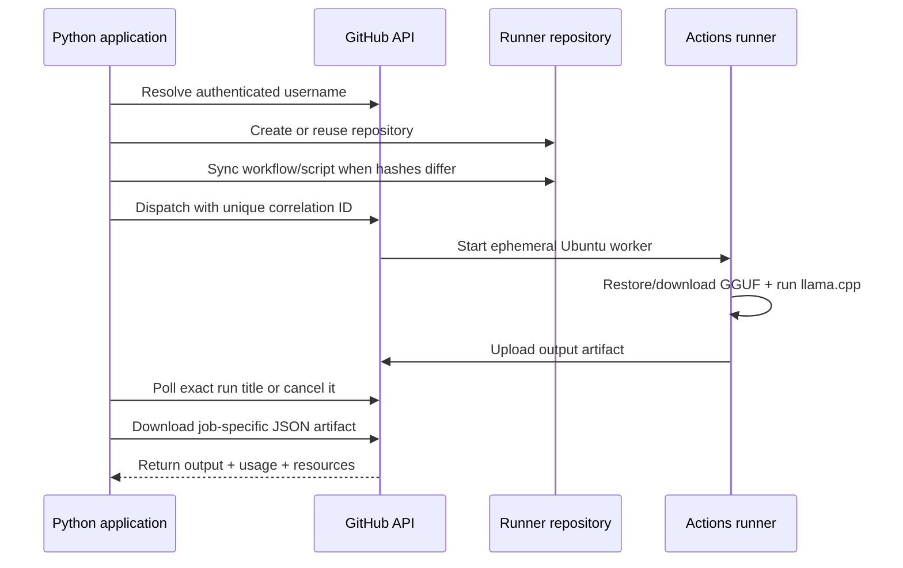

<div align="center">

<sub>Real photography by <a href="https://unsplash.com/photos/developer-typing-code-on-a-laptop-screen-xaWYIbNIOdw">Alicia Christin Gerald on Unsplash</a>.</sub>

# gh-ai-runner
### Use GitHub Actions as an ephemeral inference backend—straight from Python.

[](https://pypi.org/project/gh-ai-runner/)


[How it works](#how-it-works) · [Install](#install) · [Models](#models) · [API](#compatibility-api)
</div>

---

## Overview

`gh-ai-runner` is a Python orchestration package that turns a GitHub repository into an on-demand AI workload service. Version 0.3 adds concurrent batches, model comparisons, verified result checksums, and privacy-conscious local job metadata on top of the asynchronous 0.2 runtime. The original blocking `ai_call()` API remains compatible.

No inference server remains online between calls. GitHub supplies the temporary runner; `llama-cpp-python` executes quantized GGUF weights on CPU.

## How it works



## Install

```bash
pip install gh-ai-runner
```

Requirements:

- Python 3.9+
- GitHub personal access token with repository and workflow access appropriate to the created runner repository
- GitHub Actions enabled

## Quick start

```python
from gh_ai_runner import ai_call

answer = ai_call(
    github_token="your-token",
    prompt="Explain recursion with one small Python example.",
    model="qwen",
    temperature=0.2,
)

print(answer)
```

The first call creates or configures `ai-inference-runner`. Later calls skip file commits when the embedded workflow and script hashes match their remote contents.

## Asynchronous jobs

`submit()` returns after dispatch instead of waiting for the model. Each job has a stable ID; retries use distinct correlation IDs such as `<job-id>-1` and `<job-id>-2`.

```python
from gh_ai_runner import GitHubAIRunner, JobStatus, RetryPolicy

runner = GitHubAIRunner(github_token="your-token")
job = runner.submit(
    "Summarize the tradeoffs of SQLite and PostgreSQL.",
    model="qwen",
    retry_policy=RetryPolicy(max_retries=1),
)

print(job.job_id, job.refresh())
result = job.result(timeout=900)
print(result.output)
print(result.usage.total_tokens)
print(result.resources.memory_total_bytes)
```

`job.refresh()` is non-blocking. `job.wait()` blocks until completion, `job.result()` downloads and parses the structured result, and `job.cancel()` requests cancellation through GitHub's Actions API. A handle can be reconstructed later with `runner.get_job(job_id, attempt=1)`.

Multiple jobs can safely share one runner repository. Correlation is based on an exact workflow run title and a uniquely named artifact, rather than whichever unseen run appears first.

## Bring your own provider key

Version 0.2 supports OpenAI-compatible HTTPS providers. The key is encrypted locally with the repository's GitHub public key and stored only in the dedicated `GH_AI_PROVIDER_API_KEY` Actions secret. It is never sent through workflow inputs or written to result artifacts.

```python
from gh_ai_runner import GitHubAIRunner, ProviderConfig

runner = GitHubAIRunner("your-github-token")
groq = ProviderConfig.groq("llama-3.3-70b-versatile")

runner.configure_provider(groq, api_key="your-provider-key")
result = runner.submit("Explain B-trees.", provider=groq).result()
print(result.output, result.usage)
```

There is one dedicated provider-key slot per runner repository in 0.2. Calling `configure_provider()` again rotates that key. Custom OpenAI-compatible endpoints use `ProviderConfig(name, model, base_url)`; `base_url` must use HTTPS.

## Batches and model comparisons

Batch requests are dispatched independently, then polled concurrently:

```python
from gh_ai_runner import GitHubAIRunner, InferenceRequest

runner = GitHubAIRunner("your-github-token")
batch = runner.submit_batch([
    InferenceRequest("Summarize this release note.", model="tinyllama"),
    InferenceRequest("Write three test cases.", model="qwen"),
])

for result in batch.results(timeout=900):
    print(result.model, result.output)
```

Use `compare()` to send one prompt to several distinct local models:

```python
comparison = runner.compare(
    "Explain optimistic concurrency control.",
    models=["tinyllama", "qwen", "phi3"],
    max_tokens=300,
)

for model, result in comparison.results_by_model().items():
    print(model, result.output, result.usage.total_tokens)
```

`BatchJob.refresh()`, `wait()`, `results()`, and `cancel()` operate across the complete group while preserving request order. Every group receives a stable `batch_id`, which is also attached to its jobs and persistent metadata records.

## Integrity and persistent metadata

The client and worker independently calculate a SHA-256 digest of the normalized request. The worker also hashes the generated output. The client rejects an artifact when its job identity, request digest, output digest, or algorithm does not match.

Job metadata is stored by default in `~/.gh_ai_runner/jobs.sqlite3`. It includes job/correlation IDs, attempts, status, model, provider, run ID, timestamps, token counts, duration, and SHA-256 digests. GitHub tokens, provider keys, prompt text, system text, and output text are never stored in this database.

```python
recent = runner.list_jobs(limit=20)
resumed = runner.resume(recent[0].job_id)
print(resumed.refresh())
```

Pass `metadata_path=None` to disable persistence or supply a custom database path.

## Models

| Key | Model | GGUF size | Default context | Good fit |
|---|---|---:|---:|---|
| `tinyllama` | TinyLlama 1.1B Chat | 0.6 GB | 2,048 | Fast basic answers |
| `llama` | Llama 3.2 1B Instruct | 0.7 GB | 4,096 | General instructions |
| `phi3` | Phi-3.5 Mini Instruct | 2.2 GB | 4,096 | Stronger reasoning |
| `qwen` | Qwen 2.5 1.5B Instruct | 1.0 GB | 4,096 | Code and math |
| `gemma2` | Gemma 2 2B Instruct | 1.6 GB | 4,096 | Chat/instructions |
| `deepseek` | DeepSeek-R1 1.5B | 1.1 GB | 4,096 | Deliberative reasoning |

Validation caps context at 8,192, generated tokens at 4,096, and temperature between 0 and 2. The package estimates memory from model size plus extra context before dispatch.

## Compatibility API

```python
ai_call(
    github_token: str,
    prompt: str,
    model: str = "tinyllama",
    system: str = "You are a helpful assistant.",
    max_tokens: int = 512,
    temperature: float = 0.7,
    cache: bool = True,
    n_ctx: int | None = None,
    repo_name: str = "ai-inference-runner",
    verbose: bool = True,
) -> str
```

The function internally creates a client, submits a job, waits, and returns `InferenceResult.output` as a string.

## Package architecture

```text
gh_ai_runner/
├── client.py       asynchronous client and secure provider setup
├── job.py          status, waiting, retry, result, and cancellation handle
├── batch.py        concurrent batch and comparison handles
├── metadata.py     privacy-conscious SQLite job metadata
├── integrity.py    canonical request and output digests
├── types.py        typed results, telemetry, policies, and errors
├── core.py         backwards-compatible ai_call wrapper
├── repo.py         repo creation and hash-based file sync
├── runner.py       embedded workflow and inference script
├── models.py       model catalog and resource limits
├── validation.py   parameter and memory validation
├── polling.py      workflow run discovery/completion
├── artifact.py     output download and extraction
└── logger.py       elapsed-time progress reporting
```

## Engineering notes

- Remote file SHA-256 comparison eliminates unnecessary commits and workflow registration churn.
- A random job ID is included in `run-name`; polling requires an exact title match.
- Retry attempts keep a stable job ID and receive distinct correlation IDs.
- The worker reports CPU, memory, disk, peak RSS, duration, and model token usage.
- Local inference automatically assigns CPU threads from the detected runner resources.
- Provider secrets use GitHub sealed-box encryption and a dedicated secret slot.
- Batch result waiting is concurrent and preserves submission order.
- Result identity and SHA-256 checksums are verified before returning output.
- Persistent metadata intentionally excludes prompt, system, output, and secret values.
- The package adds a concise/direct instruction to the supplied system prompt.
- GitHub-hosted CPU inference has meaningful cold-start and generation latency; caches are best-effort.
- Tokens are passed by the caller and should come from a secret store—not source code.
- The repository declares version `0.3.0` in both package metadata and the public module.
- Distribution archives are checked into `dist/`; releases are a cleaner long-term channel.

## Skills demonstrated

Python package design · REST orchestration · CI as compute · idempotent provisioning · content hashing · polling/event correlation · artifact retrieval · resource validation · open-model deployment

## Resume-ready highlight

> Published a Python orchestration package that provisions and synchronizes GitHub-hosted inference workers, dispatches one of six quantized models, correlates workflow runs, retrieves artifacts, and exposes the entire lifecycle as one typed function call.

## License

MIT
