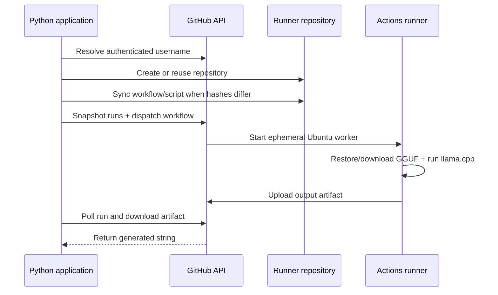

<div align="center">

<sub>Real photography by <a href="https://unsplash.com/photos/developer-typing-code-on-a-laptop-screen-xaWYIbNIOdw">Alicia Christin Gerald on Unsplash</a>.</sub>

# gh-ai-runner
### Use GitHub Actions as an ephemeral inference backend—straight from Python.

[](https://pypi.org/project/gh-ai-runner/)


[How it works](#how-it-works) · [Install](#install) · [Models](#models) · [API](#api-reference)
</div>

---

## Overview

`gh-ai-runner` is a Python orchestration package that turns a GitHub repository into an on-demand open-model inference service. A single `ai_call()` verifies or creates the runner repository, synchronizes its inference script and workflow by content hash, dispatches GitHub Actions, waits for the matching run, downloads the output artifact, and returns the generated text.

No inference server remains online between calls. GitHub supplies the temporary runner; `llama-cpp-python` executes quantized GGUF weights on CPU.

## How it works



## Install

```bash
pip install gh-ai-runner
```

Requirements:

- Python 3.9+
- GitHub personal access token with repository and workflow access appropriate to the created runner repository
- GitHub Actions enabled

## Quick start

```python
from gh_ai_runner import ai_call

answer = ai_call(
    github_token="your-token",
    prompt="Explain recursion with one small Python example.",
    model="qwen",
    temperature=0.2,
)

print(answer)
```

The first call creates or configures `ai-inference-runner`. Later calls skip file commits when the embedded workflow and script hashes match their remote contents.

## Models

| Key | Model | GGUF size | Default context | Good fit |
|---|---|---:|---:|---|
| `tinyllama` | TinyLlama 1.1B Chat | 0.6 GB | 2,048 | Fast basic answers |
| `llama` | Llama 3.2 1B Instruct | 0.7 GB | 4,096 | General instructions |
| `phi3` | Phi-3.5 Mini Instruct | 2.2 GB | 4,096 | Stronger reasoning |
| `qwen` | Qwen 2.5 1.5B Instruct | 1.0 GB | 4,096 | Code and math |
| `gemma2` | Gemma 2 2B Instruct | 1.6 GB | 4,096 | Chat/instructions |
| `deepseek` | DeepSeek-R1 1.5B | 1.1 GB | 4,096 | Deliberative reasoning |

Validation caps context at 8,192, generated tokens at 4,096, and temperature between 0 and 2. The package estimates memory from model size plus extra context before dispatch.

## API reference

```python
ai_call(
    github_token: str,
    prompt: str,
    model: str = "tinyllama",
    system: str = "You are a helpful assistant.",
    max_tokens: int = 512,
    temperature: float = 0.7,
    cache: bool = True,
    n_ctx: int | None = None,
    repo_name: str = "ai-inference-runner",
    verbose: bool = True,
) -> str
```

Parallel calls require separate `repo_name` values because each repository has its own workflow/run stream.

## Package architecture

```text
gh_ai_runner/
├── core.py         public orchestration API
├── repo.py         repo creation and hash-based file sync
├── runner.py       embedded workflow and inference script
├── models.py       model catalog and resource limits
├── validation.py   parameter and memory validation
├── polling.py      workflow run discovery/completion
├── artifact.py     output download and extraction
└── logger.py       elapsed-time progress reporting
```

## Engineering notes

- Remote file SHA-256 comparison eliminates unnecessary commits and workflow registration churn.
- Run IDs are snapshotted before dispatch to associate polling with the new invocation.
- The package adds a concise/direct instruction to the supplied system prompt.
- GitHub-hosted CPU inference has meaningful cold-start and generation latency; caches are best-effort.
- Tokens are passed by the caller and should come from a secret store—not source code.
- The repository currently declares version `0.1.6` in `pyproject.toml`; documentation/release versioning should remain synchronized.
- Distribution archives are checked into `dist/`; releases are a cleaner long-term channel.

## Skills demonstrated

Python package design · REST orchestration · CI as compute · idempotent provisioning · content hashing · polling/event correlation · artifact retrieval · resource validation · open-model deployment

## Resume-ready highlight

> Published a Python orchestration package that provisions and synchronizes GitHub-hosted inference workers, dispatches one of six quantized models, correlates workflow runs, retrieves artifacts, and exposes the entire lifecycle as one typed function call.

## License

MIT

